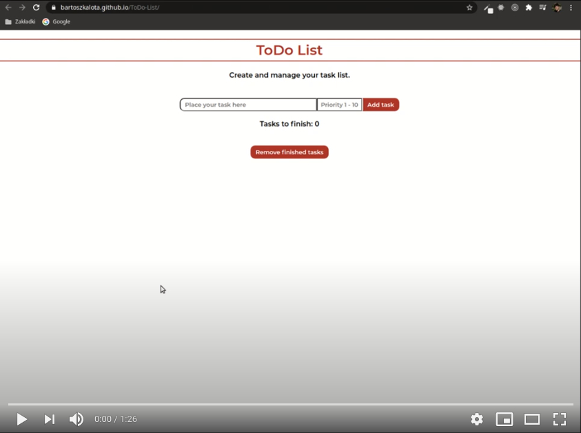

# ToDo List (Workshop-2)
You can create and manage your task list (build with JS (ES5) and CSS). The project is the part of the Coders Lab course.

# Live demo
https://bartoszkalota.github.io/ToDo-List/

# Video demo

# Features
* Tasks management:
    * adding
    * **automatic sorting in terms of priority**
    * marking as finished
    * deleting
    * calculation of the number of unfinished tasks
    * removing of finished ones
* Inputs data validation (appropriate error communications)

# Information
The aim of this project was to use JavaScript in ES5 standard. The ES6 standard is utilized in projects including at least Workshop-4 in their titles.

# Technologies
* JS (ES5)
* HTML, CSS